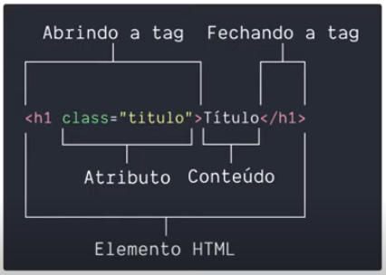

# Estrutura básica

> ## **HTML**

### **Introdução**

A criação do HTML foi motivado pela necessidade de Tim Berners-Lee em compartilhar alguns arquivos com seus colegas de trabalho.

Então, em 1980, Berners-Lee começou a criar os primeiros esboços do HTML.

Em 1991, ele lançou a primeira versão do HTML, o **HTML 1**

> **CURIOSIDADE**: o HTML 1 possuía apenas 18 elementos

A versão mais atual do HTML é o **HTML 5**, lançado em 2014.

### **Definição**

HTML (Linguagem de Marcação de HiperTexto) é o bloco de construção mais básico da web.

Define o **significado** e a **estrutura** do conteúdo da web.

### **Sintaxe**

- **Elemento HTML**:

  

- **Estrutura básica de um documento HTML**:

  ```html
  <!DOCTYPE html>
  <html>
    <head>
      <meta />
      <title></title>
    </head>
    <body></body>
  </html>
  ```

  * `<!DOCTYPE html>`: não é um elemento HTML. Ele serve apenas para indiciar ao navegador que o documento é um HTML

  * `<html></html>`: definir a estrutura da página e informá-lo ao navegador

  * `<head></head>`: prover informações (metadados) ao navegador, buscador, etc

    * `<meta />`: definir um metadado

    * `<title></title>`: definir um título na aba do navegador

  * `<body></body>`: armazenar todo o conteúdo (HTML) de uma página wbe